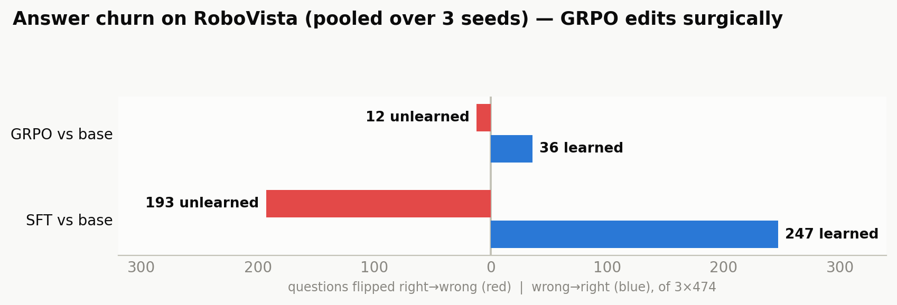
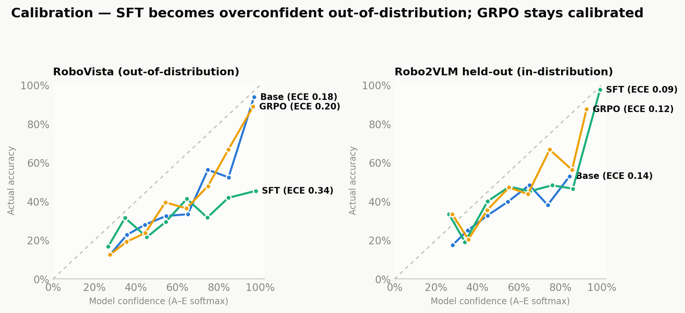

# We RL-tuned a 7B vision model on robot VQA — and SFT turned out to be the cautionary tale

*A weekend-scale learning experiment with Qwen2-VL-7B, GRPO, and the RoboVista benchmark. One AMD MI300X, ~10 GPU-hours per method, five silent bugs, and one genuinely satisfying result.*

---

## The idea

[RoboVista](https://berkeleyautomation.github.io/robovista/) (RSS 2026, Berkeley AUTOLAB) is a brutal benchmark: 474 expert-annotated multiple-choice questions about real robot scenes — surgery, agriculture, factory lines, driving. The best frontier model scores 56.5%. Random is 20%.

We had a local `Qwen2-VL-7B-Instruct` and a simple question: **if you fine-tune a small VLM on robot VQA, does it actually learn robot understanding — or does it just memorize?** The clean way to ask that is to train the *same model, same data, same LoRA adapter* with two different objectives and watch what transfers:

- **SFT** — classic supervised fine-tuning: cross-entropy on the correct answer letter.
- **GRPO** — the DeepSeek-R1-style recipe: sample 8 answers per question, reward the correct ones (+1.0, plus +0.2 for a tidy `<think>…</think> Answer: X` format), push the policy toward what worked. No value model, no TRL — we hand-wrote the loop (~250 lines) because this machine runs ROCm + Python 3.9 and no vLLM.

**Training data:** 5,000 questions streamed out of [Robo2VLM-1](https://huggingface.co/datasets/keplerccc/Robo2VLM-1) — 684k template-generated robot VQA questions whose ground truth comes from robot *sensor state* (gripper aperture, end-effector pose), not human labels. A 500-question held-out slice measures in-distribution learning.

**The exam the model never studies for:** RoboVista itself. One honest asterisk — RoboVista's `open_datasets` domain (144 questions) was built with the same Robo2VLM framework, so it's "distribution-adjacent." The other five domains (330 questions) are fully foreign, and that's where the real answer lives.

The recipe details, for the curious: LoRA r=16 on all the language-model projections (40M params, 0.48% of the model — vision tower frozen), group-normalized advantages, and a KL penalty against the reference policy. The cute trick: the reference model is *the same model with the adapter switched off* — zero extra memory. Degenerate rollout groups (all 8 answers earning the same reward = zero learning signal) get resampled instead of wasted.

## Five bugs that almost faked our results

Every one of these produced *plausible-looking numbers* before it was caught. Collect the whole set:

1. **Qwen2-VL ships `top_k=1` in its generation config.** Passing `temperature`/`top_p` to `generate()` does not override it. Our "sampling" was secretly greedy — all 8 rollouts per group were near-identical, ~85% of GRPO groups carried zero reward variance, and the model was "learning" from floating-point tie-breaks. Fix: `top_k=0`. Degenerate groups fell to ~1 in 12.
2. **sdpa attention + padded batches emits `!!!!`** on this ROCm/torch stack. The text decoder has to run eager attention; outputs then match batch-size-1 exactly.
3. **The vision tower attends over *all* images in a batch as one sequence** — quadratic memory. One 45 GB allocation attempt later, we batch by total vision patches (≤14k), not question count. (Questions carry 1–8 images.)
4. **The tokenizer pads left by default.** Our SFT label mask assumed right padding, so the model spent its first run being trained to predict *its own prompt*. Loss sat at 9.1 instead of 0.8 and nothing errored.
5. **Think-format evals need room to think.** At the letter-only default of 32 new tokens, completions truncated mid-`<think>` and scored near-random — GRPO briefly looked like a 15% model and the "finding" would have been "RL destroys VLMs."

## Watching GRPO learn


Four panels, one story. **Format compliance saturates in ~25 steps** — the fastest thing RL learns is the *shape* of an answer, not its content. Rollout accuracy then grinds from ~29% to ~44% over 300 steps (about 4.5 hours on one MI300X) and is still climbing at the end. KL stays in a calm 0.03–0.08 band — the policy moves, but never runs away from the base model. Hold that thought; it becomes the whole story.

## The scoreboard


We ran everything three seeds deep (numbers below are mean ± sd):

| Model / prompt | RoboVista (never trained on) | Robo2VLM held-out (in-distribution) |
|---|---|---|
| Base, letter-only | 33.5% | 33.2% |
| Base, CoT / think / ICL k=2 | 31.0 / 31.6 / 25.3% | — |
| **SFT** | 37.3 ± 1.0% | **79.5 ± 1.7%** |
| **GRPO** | 35.2 ± 0.2% | 39.5 ± 0.9% |
| **GRPO, think-format** | 33.1 ± 1.1% | 41.3 ± 1.7% |

(Fun fact: nobody had put Qwen2-VL-7B on the RoboVista leaderboard, so that 33.5% baseline is a new public data point. For scale: Qwen2.5-VL-**72B** gets 44.3%.)

First read: SFT wins everywhere! +46 points in-distribution, best transfer number too. Case closed?

## The twist: SFT's transfer is fake

This is where running actual statistics (paired McNemar tests, pooled across seeds) paid off. Split RoboVista into the one distribution-adjacent domain vs the five fully-foreign ones:

| Test (pooled, 3 seeds) | flips right→wrong / wrong→right | p |
|---|---|---|
| SFT vs base, all of RoboVista | 193 / 247 | 0.011 |
| **SFT vs base, foreign domains only** | 137 / 122 | **0.38 — net negative!** |
| GRPO vs base, all of RoboVista | 12 / 36 | 7×10⁻⁴ |
| **GRPO vs base, foreign domains only** | 11 / 30 | **0.0043 ✓** |

**SFT's entire transfer gain is the one familiar domain** (open_datasets: 37.5→53.5%, the only statistically significant domain change). On the five domains its templates never covered, SFT got *worse* than the base model. GRPO's smaller gain is the one that survives on genuinely foreign robot problems.


The heatmap makes it visceral. SFT: +15 where its training framework lives, **collapse toward random** on driving (40→20), agriculture (32→19), industrial (26→18). GRPO never moves more than ±4 anywhere. Same data, same adapter — *the objective alone decided what generalizes.*

## Why? SFT overwrites; GRPO edits



Pooled across seeds, **SFT rewrote 440 of the 3×474 RoboVista answers** — including 193 the base model had right. It also abandoned the base model's answer prior wholesale (the base model, amusingly, answers "A" half the time; SFT flattened that to match its training distribution, χ²=1010). **GRPO changed 48 answers. Three-quarters of them for the better.** That's what a KL leash plus on-policy sampling buys you: local, surgical, mostly-beneficial edits.



Calibration tells the same story from a third angle. Out-of-distribution, SFT's confidence jumped 17 points while its accuracy gained 2 — expected calibration error nearly doubled (0.18→0.34; that's the green curve flatlining under the diagonal). GRPO's calibration is indistinguishable from base. The memorizer doesn't just fail quietly on foreign domains; it fails *confidently*.

## Did the RL-trained reasoning actually help?

The RoboVista paper found that chain-of-thought *hurts* perception questions but helps planning — in frontier models. At 7B zero-shot, we only ever got the hurt (thinking cost the base model 2–12 points everywhere). After GRPO:


The frontier pattern shows up: **planning +6.7, perception still −8.8**. RL taught the model reasoning that helps it *decide*, but no amount of reasoning fixes what the (frozen!) vision tower mis-sees. Honesty checkpoint: at n≈70 questions per ability class, these ability-level effects don't reach significance across seeds (p≈0.15–0.53) — the direction is consistent, the sample is just small. What *does* recur in every seed: in-distribution, thinking helps the GRPO model (41.3 vs 39.5) where it hurt the base model.

## We hand-labeled 102 errors to see what's still broken

We built a little gradio labeler showing each wrong answer next to the expert's reasoning and tagged the primary failure (reweighted to the true error mix):

| Why the RL model still gets things wrong | Share |
|---|---|
| Task reasoning (right scene, wrong logic) | 40.9% |
| Misidentification (saw the wrong thing) | 33.2% |
| Spatial reasoning (right objects, wrong geometry) | 23.2% |
| Format / refusal / other | 2.7% |

**56% of remaining errors are perception-bound** — and our misidentification share (33.2%) lands within a point of the RoboVista paper's own figure for small models (30.2%). Bonus finding: wrong answers carry *longer* think-traces than right ones in every category. The model reasons hardest exactly where reasoning can't help.

## What we actually learned

1. **The objective, not the data, decided what generalized.** Same 5,000 questions, same adapter: SFT memorized the template distribution (79.5% in-distribution!) and paid for it everywhere else; verifiable-reward RL learned less, but what it learned was real.
2. **In-distribution accuracy is a seductive lie.** If we'd only evaluated on held-out Robo2VLM questions, SFT would look like a triumph. The foreign-domain split was the entire experiment.
3. **RL's conservatism is a feature.** 48 surgical edits vs 440 rewrites; intact calibration vs confident nonsense. The KL penalty isn't a hyperparameter formality — it's *why* the method transfers.
4. **Perception is still the bottleneck** (the RoboVista thesis, confirmed post-RL). Answer-level rewards never train the frozen vision tower. The obvious next experiment: feed the model tool-annotated images (GroundingDINO boxes, SAM masks, depth maps) and see if the 56% perception-bound error mass moves.
5. **Most of "doing RL" is debugging things that don't error.** Five separate bugs produced plausible numbers. Sampling that wasn't sampling, losses on the wrong tokens, evals that truncated the answers — the reward curve looked fine through all of it.

## Reproduce it

```
rl/
  export_robo2vlm.py    # stream 5.5k questions out of the 107 GB dataset
  grpo_train.py         # hand-written GRPO (LoRA, verifiable rewards, KL vs disabled adapter)
  sft_train.py          # the LoRA-SFT baseline
  stats.py              # bootstrap CIs, exact McNemar, Holm correction
  calibration_eval.py   # A–E logprob confidence, ECE, reliability data
  error_analysis.py     # flip matrices, letter-prior shift, think-length stats
  error_labeler.py      # the gradio labeling UI
  make_figures.py       # regenerates every figure in this post
```

```bash
python rl/export_robo2vlm.py --train 5000 --heldout 500 --out rl_data
PYTHONPATH=.rl-deps python rl/grpo_train.py --data-dir rl_data/train \
    --model-path <Qwen2-VL-7B-Instruct> --output-dir rl_runs/grpo --steps 300
PYTHONPATH=.rl-deps python rl/sft_train.py --data-dir rl_data/train \
    --model-path <Qwen2-VL-7B-Instruct> --output-dir rl_runs/sft --epochs 2
PYTHONPATH=.rl-deps python benchmark/run_benchmark_local.py --data-dir data_local \
    --model-path <Qwen2-VL-7B-Instruct> --adapter rl_runs/grpo/adapter_latest --prompts standard rl
python rl/stats.py && python rl/make_figures.py
```

*Benchmarks: [RoboVista](https://berkeleyautomation.github.io/robovista/) (RSS 2026) and [Robo2VLM-1](https://huggingface.co/datasets/keplerccc/Robo2VLM-1) (Berkeley AUTOLAB). Method lineage: DeepSeek-R1's GRPO / RLVR, applied to multiple-choice robot VQA. All experiments: one shared 8×MI300X box, ROCm 6.2, no vLLM, no TRL, a 200 GB disk quota, and a lot of `rocm-smi`.*
