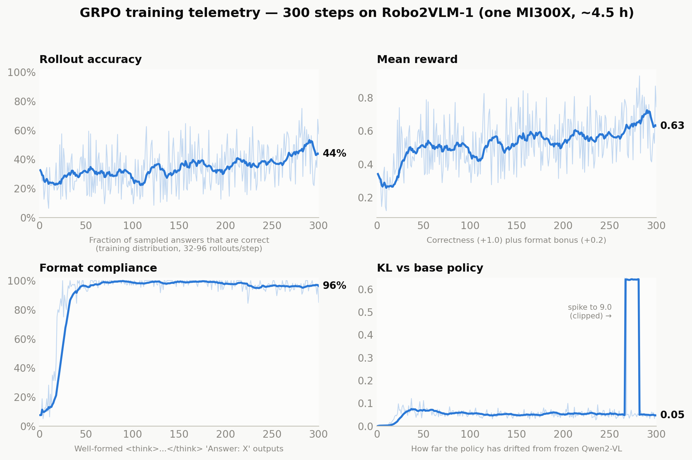
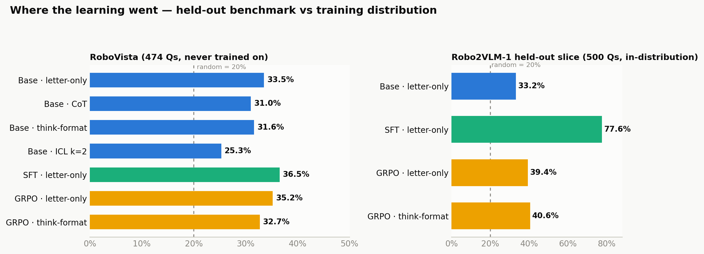
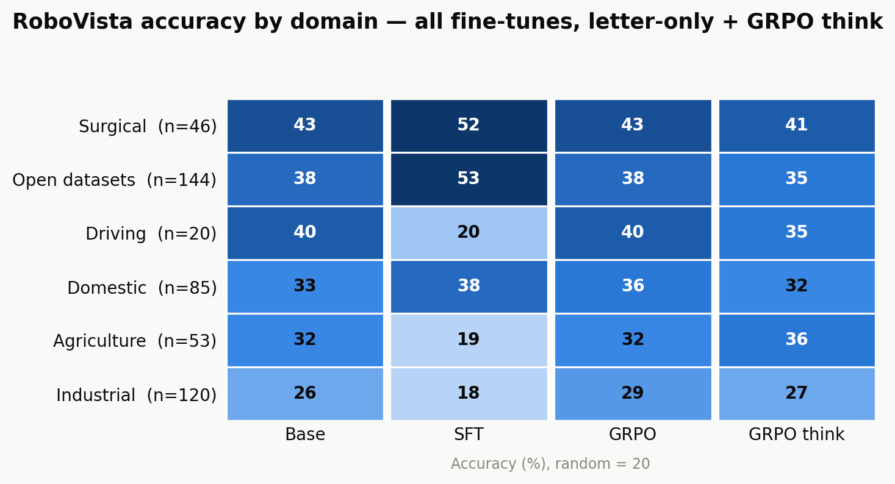
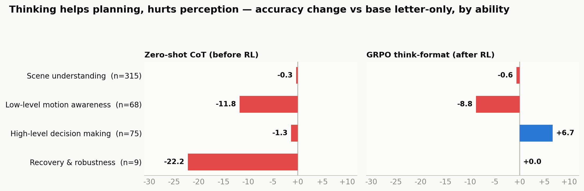

# RoboVista-R1: RL fine-tuning Qwen2-VL-7B on robot VQA

**TL;DR** — We fine-tuned Qwen2-VL-7B-Instruct on robot visual-question-answering with
two methods trained on identical data: R1-style **GRPO** (reinforcement learning with
verifiable rewards) and a **LoRA-SFT** baseline. SFT looks better on raw numbers but
mostly memorized its training templates — it *collapsed below random* on three unseen
RoboVista domains. GRPO learned less in absolute terms but generalized evenly, and it
reproduced at 7B a phenomenon the RoboVista paper only observed at frontier scale:
**learned reasoning helps planning (+6.7) while perception stays broken (−8.8)**.

---

## 1. Setup

### What was trained

| | |
|---|---|
| Base model | `Qwen2-VL-7B-Instruct` (local safetensors) |
| Adapter | LoRA r=16, α=32 on all LM attention + MLP projections (~40.4M params, 0.48%) |
| Frozen | Vision tower, merger, everything else |
| Precision | bf16, gradient checkpointing, single MI300X per run |

### Data — and why RoboVista stays clean

Training data is a **5,000-question shuffled subset of Robo2VLM-1**
([`keplerccc/Robo2VLM-1`](https://huggingface.co/datasets/keplerccc/Robo2VLM-1)):
684k template-generated multiple-choice questions derived from real DROID /
Open X-Embodiment robot trajectories, with ground truth from robot sensor state
(gripper aperture, end-effector pose, force). A further **500-question held-out slice**
measures in-distribution learning. **RoboVista itself is never trained on** — it is the
out-of-distribution transfer benchmark. (Caveat: RoboVista's `open_datasets` domain was
*built with* the Robo2VLM framework, so that domain is distribution-adjacent; the other
five domains are fully foreign.)

Exported via `rl/export_robo2vlm.py` (streaming + shuffle buffer, no 107 GB download).

### The two trainers

**GRPO** (`rl/grpo_train.py`, hand-written — no TRL; this stack is py3.9/transformers
4.48/ROCm): per step, 4 prompts × 8 sampled completions. Reward is *verifiable*: +1.0
if the parsed letter is correct, +0.2 if the output is a well-formed
`<think>…</think>` + `Answer: X`. Advantages are group-normalized (no value model);
loss is token-level policy gradient with a k3 KL penalty (β=0.04) against the
reference policy — implemented as **the same model with the adapter disabled**, so no
second model in memory. Degenerate groups (all 8 rollouts same reward → zero signal)
are resampled, DAPO-style. 300 steps ≈ 4.5 h.

**SFT** (`rl/sft_train.py`): same LoRA config, same 5k questions, 2 epochs,
cross-entropy on the answer letter only (prompt masked out). ≈ 45 min.

---

## 2. GRPO training dynamics



Reading the four panels:

- **Rollout accuracy** (top-left): the fraction of sampled answers that are correct on
  training questions — the policy's live performance. Climbs from ~29% to a ~44%
  rolling average, still rising at step 300 (more steps would likely help).
- **Mean reward** (top-right): accuracy plus the format bonus; tracks accuracy once
  format saturates.
- **Format compliance** (bottom-left): the +0.2 bonus taught the
  `<think>…</think> Answer: X` template in ~25 steps — the fastest thing RL learns is
  the *shape* of the answer, not its content.
- **KL vs base policy** (bottom-right): stays in a healthy 0.03–0.08 band (one
  transient spike to ~9 at step ~267 self-recovered — visible as the clipped plateau).
  The policy moved meaningfully but never ran away from the base model.

## 3. Headline results



| Model / prompt | RoboVista (474, held-out) | Robo2VLM slice (500, in-dist) |
|---|---|---|
| Base, letter-only | 33.5% | 33.2% |
| Base, CoT | 31.0% | — |
| Base, think-format | 31.6% | — |
| Base, ICL k=2 | 25.3% | — |
| **SFT**, letter-only | **36.5%** (+3.0) | **77.6%** (+44.4) |
| **GRPO**, letter-only | 35.2% (+1.7) | 39.4% (+6.2) |
| **GRPO**, think-format | 32.7% | **40.6%** (+7.4) |

Context: random = 20%; RoboVista leaderboard — Qwen2.5-VL-72B 44.3%, best (Gemini 2.5
Pro) 56.5%. There is no public Qwen2-VL-7B entry, so the 33.5% baseline is itself a new
data point.

**The transfer story in one sentence:** SFT converts +44.4 in-distribution into only
+3.0 out-of-distribution (a 15:1 memorization ratio), while GRPO converts +7.4 into
+1.7 (4:1) — RL learned less, but more of what it learned was real.

## 4. Where the gains and losses live



The domain heatmap is the sharpest evidence of SFT's memorization:

- **SFT is bimodal.** It jumps on `open_datasets` (38→53) — the domain built with the
  same Robo2VLM framework it trained on — and on surgical (43→52), but **collapses to
  or below random** on driving (40→20), agriculture (32→19), and industrial (26→18).
  The supervised objective sharpened template priors that simply don't exist in
  foreign domains, and paid for it.
- **GRPO never collapses.** Its per-domain profile is flat-to-positive everywhere
  (worst: driving 40→40, industrial 26→29). The KL leash plus on-policy sampling keeps
  the policy close enough to the base model that it can't unlearn whole domains.



By ability type (vs base letter-only, RoboVista):

- **Before RL** (left): making the base model think is a pure tax — every ability gets
  worse, catastrophically so for low-level motion awareness (−11.8) and the small
  recovery set (−22.2). This replicates the paper's "CoT degrades perception" finding
  at 7B, but *without* the planning upside the paper saw in frontier models.
- **After RL** (right): the trained think-format now *helps* high-level decision
  making (+6.7, 29.3→36.0) while low-level perception still degrades (−8.8). **RL
  taught reasoning that helps planning; it cannot reason away perception errors.**
  That is precisely RoboVista's central thesis — "perception is the bottleneck" — now
  visible inside a single 7B model before/after RL.
- In-distribution the sign flips outright: thinking helps the GRPO model (39.4→40.6)
  where it hurt the base model (33.5→31.6).

## 5. Honest caveats

- Single seed, single run per method; deltas under ~2 points are noise-level.
- GRPO saw only ~1.2k unique questions (300 steps × 4 prompts); the curve was still
  rising. Longer runs / more data are the obvious next lever.
- The 500-question held-out slice shares *templates* with training (that's what makes
  the SFT number diagnostic of memorization rather than proof of skill).
- RoboVista `open_datasets` shares its generation framework with the training data;
  domain-level transfer claims exclude it (§4 discusses it explicitly).

## 6. Gotchas that cost real debugging time (all fixed in the scripts)

1. **Qwen2-VL ships `top_k=1` in `generation_config.json`.** Passing
   `temperature`/`top_p` to `generate()` does *not* override it — sampling is silently
   greedy. In GRPO this made all 8 rollouts per group near-identical: ~85% of groups
   had zero reward variance and the model was "learning" from floating-point
   tie-breaks. Fix: pass `top_k=0` explicitly.
2. **sdpa attention + padded batches → garbage (`!!!!`)** on this ROCm 6.2 / torch
   2.5.1 stack. The text decoder must run `eager`; the vision tower (no padding,
   quadratic memory under eager) stays `sdpa` — the runner swaps per-module.
3. **Vision attention is quadratic over *all* images in a batch** (one concatenated
   sequence). Batch by total vision patches (≤14k), not question count — questions
   have 1–8 images.
4. **The tokenizer pads left by default.** SFT label masking that assumes right
   padding silently trains the model to predict its own prompt (loss ~9 instead of
   ~0.8). Set `padding_side="right"` for training.
5. **Think-format evals need `max_new_tokens` ≥ ~512.** At the letter-only default
   (32), completions truncate mid-`<think>` and score near-random — this briefly made
   GRPO look like a 15% model.

## 7. Files & reproduction

```
rl/
  export_robo2vlm.py   # stream + export the Robo2VLM-1 subset (train/heldout)
  grpo_train.py        # hand-written GRPO (LoRA, verifiable rewards, KL vs disabled adapter)
  sft_train.py         # LoRA-SFT baseline, answer-token loss only
  make_figures.py      # regenerates figures/ from logs + eval summaries
  figures/             # fig1..fig4 (this document)
  RESULTS.md           # this file
rl_runs/grpo/adapter_latest   # trained GRPO adapter (~160 MB)
rl_runs/sft/adapter_final     # trained SFT adapter
rl_data/{train,heldout}/      # exported data (5,000 / 500 questions)
```

```bash
# data (once)
python rl/export_robo2vlm.py --train 5000 --heldout 500 --out rl_data

# train
PYTHONPATH=.rl-deps python rl/grpo_train.py --data-dir rl_data/train \
    --model-path <Qwen2-VL-7B-Instruct> --output-dir rl_runs/grpo --steps 300
PYTHONPATH=.rl-deps python rl/sft_train.py --data-dir rl_data/train \
    --model-path <Qwen2-VL-7B-Instruct> --output-dir rl_runs/sft --epochs 2

# evaluate (any adapter, any prompt config from benchmark/prompts.json)
PYTHONPATH=.rl-deps python benchmark/run_benchmark_local.py --data-dir data_local \
    --model-path <Qwen2-VL-7B-Instruct> --adapter rl_runs/grpo/adapter_latest \
    --prompts standard rl

# figures
python rl/make_figures.py
```

Training/eval environment quirks (ROCm, shared GPUs, disk quota) are documented in the
gotchas above; the benchmark runner (`benchmark/run_benchmark_local.py`) embeds all the
workarounds.
